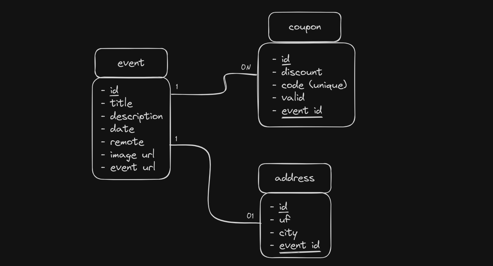

# 🎟️ Event Ease

An application for managing technology events, allowing the registration, listing,
filtering and detailing events, as well as association of descount coupons.

#### 🚧 Event Ease 🚀 Under construction... 🚧

### ✅ Features

- [ ] Event registration
- [ ] Event details view
- [ ] Event viewing
- [ ] Event filtering
- [ ] Association of coupons with events

[comment]: # "DEMO HERE"

### ✋ Prerequisites

[comment]: # "PREREQUISITES HERE"

### 🎲 Running

[comment]: # "RUNNING HERE"

### 🛠 Technologies

[comment]: # "TECHNOLOGIES HERE"

### 💼 Requirements Gathering

- [ ] The system must allow the user to register an event with following fields:
  - Title
  - Description (optional)
  - Date
  - Remote
  - Event URL (if remote)
  - Location (if not remote)
  - Image (optional)
- [ ] The system must allow the user to associate one or more discount coupons
      with an event. Each coupon must contain the following fields:
  - Code
  - Discount
  - Expiration date (optional)
- [ ] The system should only list events that have not yet happened, with pagination
      and allow the user to filter by title, date or location

